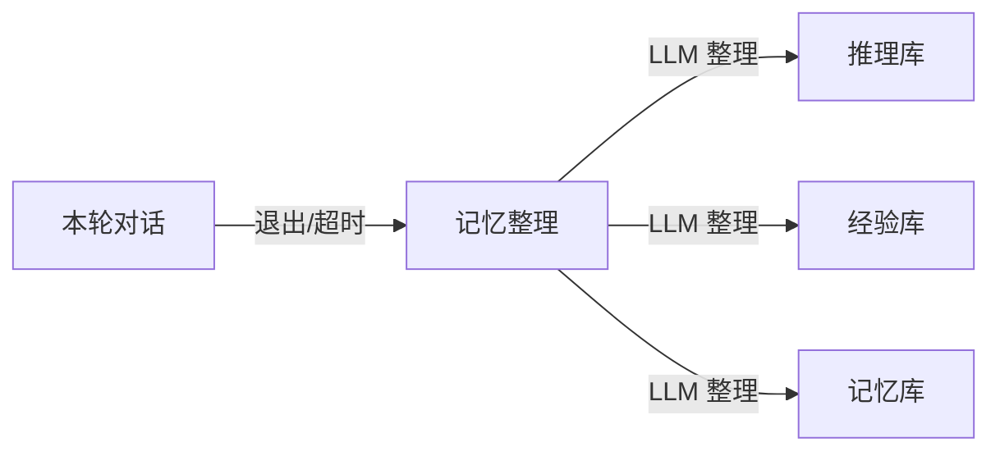
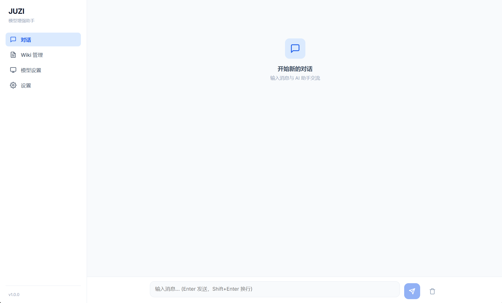
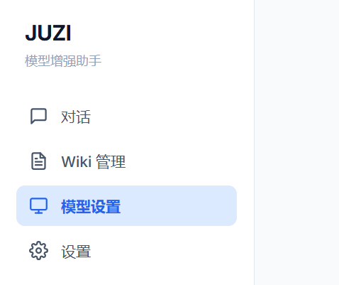
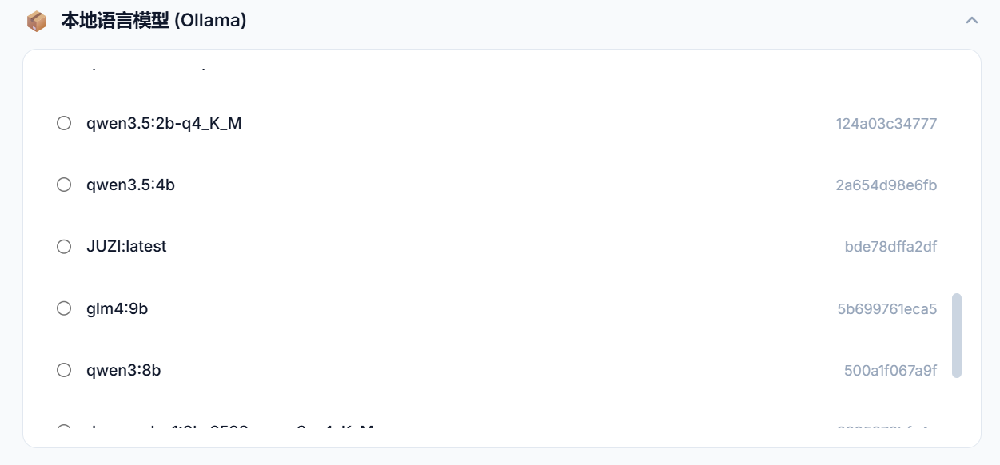
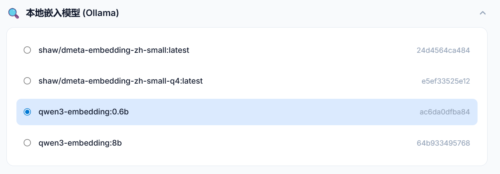
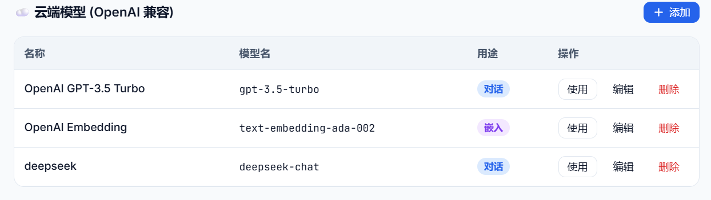
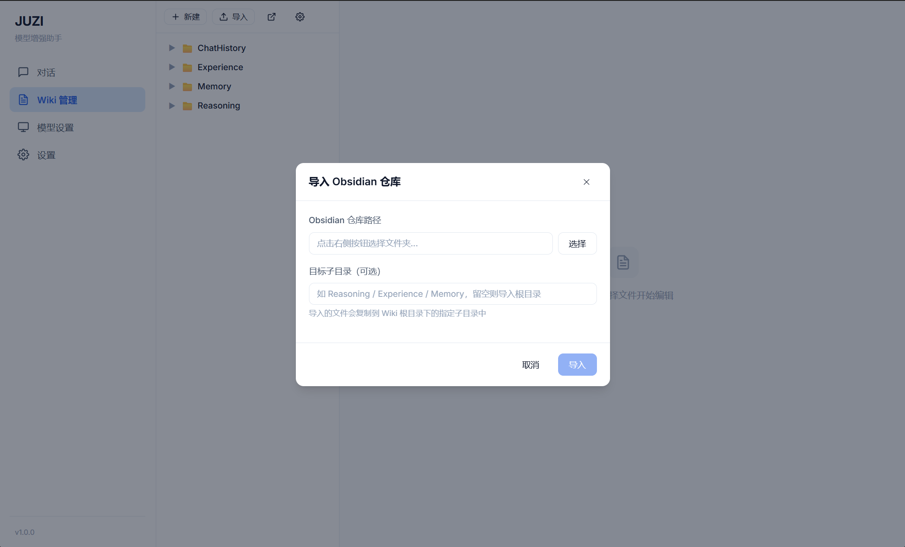

# 🌱🍊 JUZI-RAGnet(demo)

> **让语言模型从“种子”成长为“巨子”**  
> *Cognitive Enhancement Layer for Language Models*

[](https://opensource.org/licenses/Apache-2.0)
[](https://www.python.org/downloads/)
[](https://github.com/langchain-ai/langChain)

---

## 📌 什么是 JUZI-RAGnet？

**JUZI-RAGnet** 是一个即插即用的**认知增强层**，它位于“语言模型”与“应用程序”之间，通过工程化的**自省循环**、**分层记忆系统**和**按需检索**，显著提升语言模型在复杂任务中的表现。它可以作为独立服务，以 OpenAI 兼容 API 的形式供任何客户端（如openclaw）调用。

**核心理念**：用架构复杂度换取模型规模 —— 让小语言模型（如 4B 参数量）在特定任务上接近甚至超越传统llm的效果，同时保持**低成本、高隐私、本地部署**。

> **“JUZI”取自中文“巨”与“子”的组合：“巨”代表巨大，“子”是小的后缀（如粒子、种子）。寓意每一个小模型（种子）都能通过这套系统成长为领域“巨子”。**  
> **“RAGnet”则强调检索增强（RAG）与自省循环（网络）的深度融合。**

---

## ✨ 核心特性

| 特性 | 说明 |
|------|------|
| **🔄 自省循环** | 思考 → 经验检索 → 错误检查 → 输出。模拟人类“先想后审”的思考过程。 |
| **🧠 LLM-Wiki记忆** | 记忆库（用户画像）、经验库（成功/失败案例）、推理库（逻辑学思想）。 |
| **🛠️ 工具调用** | 支持 OpenAI 兼容的外部工具扩展，可接入任何支持的Agent产品 |
| **🎯 结构化输出** | 强制输出 Pydantic 模型，配合规划验证器确保计划合法性。 |
| **🌐 OpenAI 兼容 API** | 无缝接入 OpenClaw、Hermes Agent 等任何支持该标准的客户端。（还未测试） |
| **🧹 智能记忆整理** | LLM 驱动的自动整理：能够编译，沉淀知识和对话记忆。 |
| **📖 学习能力** | 通过在对话中不断丰富的经验库和记忆库，让LLM越来越聪明。 |

---

## 🧠 架构图

```mermaid
graph TD
    A[用户输入] --> B[推理思考节点]
    B --> C[经验连接节点]
    C --> D[反思检查节点]
    D -->|否| B
    D -->|是| E[最终输出节点]
    F[推理库] --> B
    G[经验库] --> C
    H[记忆库] --> C
    G --> D
    H -->D
 ```
## 🔍 知识库检索系统

```mermaid
graph TD
    A[用户输入] --> B[混合检索]
    B --> C[知识图谱拓展]
    C --> D[知识编译]
    D --> E[注入节点]
    E --> F[节点输出] --> B
    
```

## 🗂️ 记忆整理系统(目前需要通过接入Agent实现)



## 🚀 快速开始

### 1.下载与安装
为方便大家使用，JUZI提供了图形化的操作界面 \
在`Releases`中选择版本并下载（目前仅支持Windows）\
点击下载后的.exe文件后，即可一键安装启动

### 2.客户端的使用

#### 开始页面，可以在这里与增强后的模型对话。



---

#### 模型选择

在目录中，点击模型选择选项






你可以选择本地模型（目前仅支持ollama）和云端模型（由于增强层的性质，比一般调用费token）

---

#### wiki管理

增强层的架构决定了其对模型的增强效果强依赖于知识库的质量，因此想要让模型获得大幅度的增强请务必按照`推理库`、`经验库`、`记忆库`来划分md文件。
- Reasoning(推理库)：如存放逻辑学，思维和方式等方法论 \
- Experience(经验库)：如存放规律总结，经验教训等实践论 \
- Memory(记忆库)：存放自己的用户画像，可以让ai参考后输出符合自身条件的回答


当然，JUZI也支持导入已有的md文件，如obsidian。
> 目前仓库中有相关的知识库文档可以获取，对模型的古诗创作和推理质量提供增强效果：\
> 1.通过载入仓库中的古诗创作wiki，可以让4b参数的模型生成出200b+模型的生成效果 \
> 2.通过载入仓库中的深度推理wiki，可以让4b参数的模型达到约13~20b的模型推理质量


---

## 🧩 扩展开发

### 添加新知识

在 `wiki/` 下的不同文件夹下建立新的.md文件

---

## 🤝 贡献

欢迎提交 Issue 和 Pull Request！请确保：

- 代码符合 PEP8 风格
- 新功能包含必要的注释和文档
- 提交前运行 `python -m pytest` 确保测试通过

详见 [CONTRIBUTING.md](CONTRIBUTING.md)。

---

## 📄 许可证

本项目采用 **Apache 2.0 许可证**，详情见 [LICENSE](LICENSE) 文件。

---

## 🙏 致谢

- [LangChain](https://github.com/langchain-ai/langchain) – 基础组件
- [LangGraph](https://github.com/langchain-ai/langgraph) – 图编排
- [Ollama](https://ollama.com/) – 本地模型运行
- [Chroma](https://www.trychroma.com/) – 向量数据库
- [Tavily](https://tavily.com/) – 搜索 API

---

### 最后

我时常在想，人类之所以比动物聪明，不是因为我们单个大脑有多强大，而是因为我们发明了文字和书籍，把知识外化了。每一代人不需要从零开始，可以直接站在前人的肩膀上。

这套架构，就是给AI装上了一座图书馆，并教会了它如何查资料、如何做笔记、如何在考试时先打草稿再誊写。

它还很稚嫩，但方向是对的。因为我始终认为，真正的智能不是`模型`的“智能”，而是`系统`的智能。

> 如果这个项目对你有帮助，请给一个 ⭐️ Star 支持一下！
让更多语言模型从种子成长为“巨子”。

