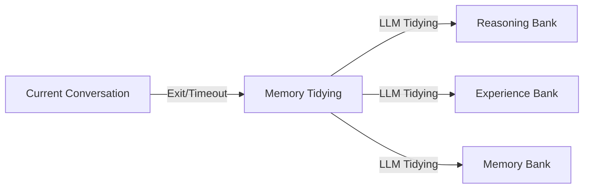

# 🌱🍊 JUZI-RAGnet(demo)

> **Let Language Models Grow from "Seeds" into "Giants"**  
> *Cognitive Enhancement Layer for Language Models*

[](https://opensource.org/licenses/Apache-2.0)
[](https://www.python.org/downloads/)
[](https://github.com/langchain-ai/langChain)

---

## 📌 What is JUZI-RAGnet?

JUZI-RAGnet is a plug-and-play cognitive enhancement layer that sits between the language model and the application. Through an engineered introspective loop, hierarchical memory system, and on-demand retrieval, it significantly boosts the performance of language models on complex tasks. It can run as an independent service and be called by any client (such as openclaw) via an OpenAI-compatible API. \
Core philosophy: Trade architectural complexity for model scale — enabling small language models (e.g., 4B parameters) to approach or even surpass the performance of traditional large language models on specific tasks, while maintaining low cost, high privacy, and local deployment.
> **“JUZI”is derived from the Chinese characters “巨”(giant) and“子”(a small suffix, as in particle, seed). It symbolizes that every small model (seed) can grow into a domain “giant” through this system.**  
> **“RAGnet” emphasizes the deep integration of Retrieval-Augmented Generation (RAG) and the introspective loop (network).**

---

## ✨ Core Features

| Feature | Description |
|------|------|
| **🔄  Introspective Loop** | Think → Experience Retrieval → Error Check → Output. Simulates the human thought process of “thinking first, then reviewing.” |
| **🧠 LLM-Wiki Memory** | Memory Bank (user profiles), Experience Bank (success/failure cases), Reasoning Bank (logic & methodology). |
| **🛠️ Tool Calling** | Supports OpenAI-compatible external tool extensions, integrable with any supported Agent products. |
| **🎯 Structured Output** | Forces Pydantic model output, cooperates with a planning validator to ensure plan legality. |
| **🌐 OpenAI-Compatible API** | Seamlessly integrates with OpenClaw, Hermes Agent, and any client supporting this standard. (Not yet tested) |
| **🧹 Intelligent Memory Tidying** | LLM-driven automatic organization: can compile and crystallize knowledge and conversational memories. |
| **📖 Learning Ability** | Through continuously enriched experience and memory banks during conversations, the LLM gets smarter over time. |

---

## 🧠 Architecture Diagram

```mermaid
graph TD
    A[User Input] --> B[Reasoning Node]
    B --> C[Experience Connection Node]
    C --> D[Reflection Check Node]
    D -->|No| B
    D -->|Yes| E[Final Output Node]
    F[Reasoning Bank] --> B
    G[Experience Bank] --> C
    H[Memory Bank] --> C
    G --> D
    H --> D
 ```
## 🔍 Knowledge Base Retrieval System

```mermaid
graph TD
    A[User Input] --> B[Hybrid Retrieval]
    B --> C[Knowledge Graph Expansion]
    C --> D[Knowledge Compilation]
    D --> E[Inject into Node]
    E --> F[Node Output] --> B
    
```

## 🗂️ Memory Tidying System (Currently requires Agent integration)



## 🚀 Quick Start

### 1. Download & Installation
For convenience, JUZI provides a graphical user interface.
Go to `Releases`, select a version, and download (currently Windows only).
After downloading the`.exe`file, one-click install and launch.

### 2. Using the Client

#### Start Page – Chat with the enhanced model here.


---

#### Model Selection

In the menu, click the model selection option.


You can choose local models (currently only Ollama supported) and cloud models (due to the nature of the enhancement layer, it consumes more tokens than typical calls).

---

#### Wiki Management

The enhancement layer’s architecture determines that its boosting effect strongly depends on knowledge base quality. Therefore, to achieve significant model enhancement, please make sure to divide your markdown files according to the `推理库`,`经验库`, and`记忆库`categories.
- Reasoning: Store methodologies such as logic, thinking patterns, and approaches. 
- Experience: Store practical summaries like rule summaries, lessons learned, etc. 
- Memory: Store your own user profile, allowing the AI to reference it and produce responses tailored to your conditions.


Of course, JUZI also supports importing existing markdown files, such as from Obsidian.
> The repository currently provides related knowledge base documents to enhance the model’s poetic composition and reasoning quality: \
> 1.By loading the poetry composition wiki from the repository, a 4B-parameter model can produce output quality comparable to a 200B+ model. \
> 2.By loading the deep reasoning wiki from the repository, a 4B-parameter model can achieve reasoning quality comparable to a ~13–20B model.


---

## 🧩 Extension Development

### Adding New Knowledge

Create new `.md` files under the respective folders inside `wiki/`.

---

## 🤝 Contributing

Issues and pull requests are welcome! Please ensure:

- Code follows PEP8 style.
- New features include necessary comments and documentation.
- Run `python -m pytest` before submitting to ensure tests pass.

See [CONTRIBUTING.md](CONTRIBUTING.md) for details.

---

## 📄 License

This project is licensed under the **Apache 2.0 License**，See the [LICENSE](LICENSE) file for details.

---

## 🙏 Acknowledgments

- [LangChain](https://github.com/langchain-ai/langchain) – foundational components
- [Ollama](https://ollama.com/) – local model runtime
- [Chroma](https://www.trychroma.com/) – vector database
- [Tavily](https://tavily.com/) – search API

---

### Finally

I often think about why humans are smarter than animals. It’s not because our individual brains are far more powerful, but because we invented writing and books, externalizing knowledge. Each generation doesn’t need to start from scratch; we can directly stand on the shoulders of those who came before. 

This architecture is precisely about equipping AI with a library and teaching it how to look up information, how to take notes, and how to draft before writing the final version — just like during an exam. 

It is still very young, but the direction is right. Because I have always believed that true intelligence is not the “intelligence” of the model, but the intelligence of the system.

> If this project has helped you, please give a ⭐️ Star to support it!
Let more language models grow from “seeds” into “giants.”
